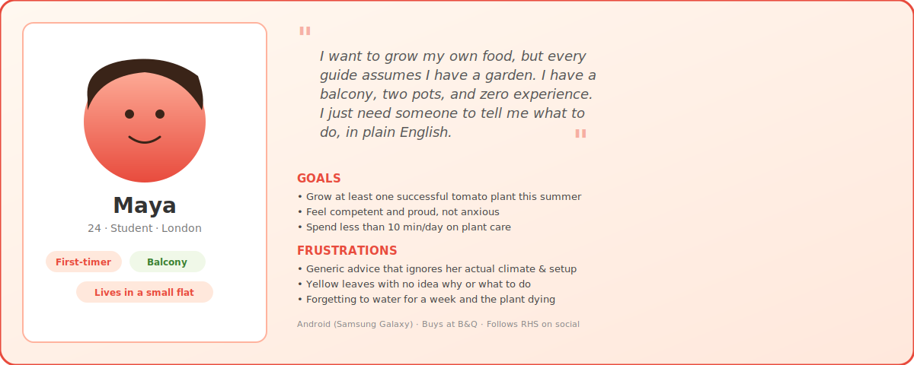
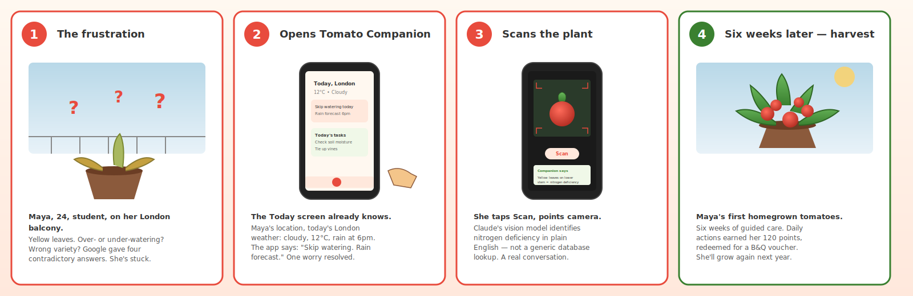
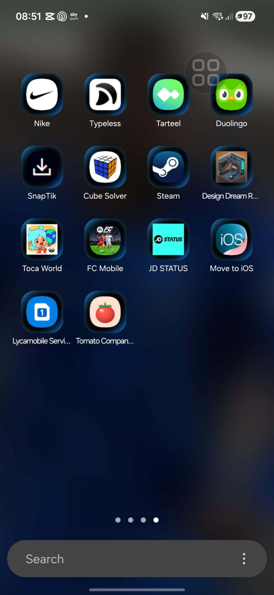
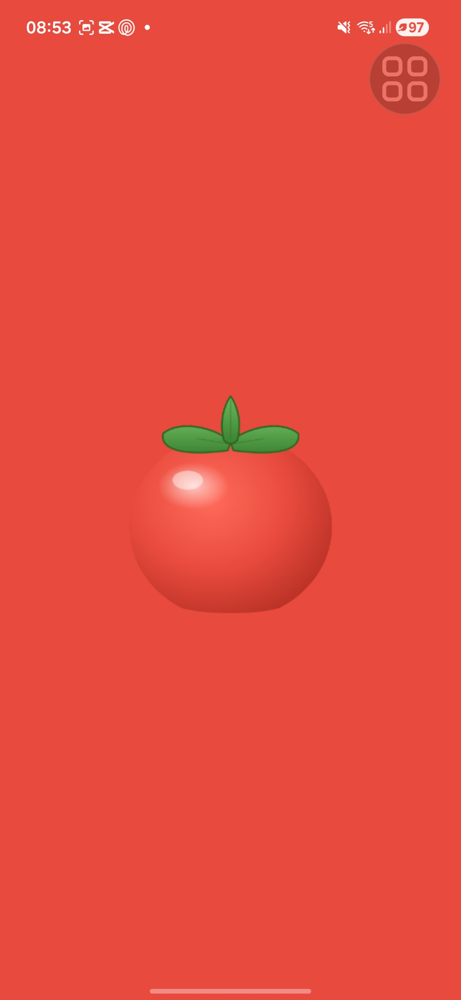
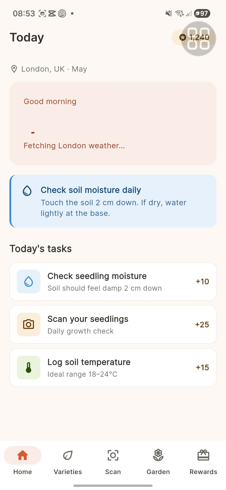
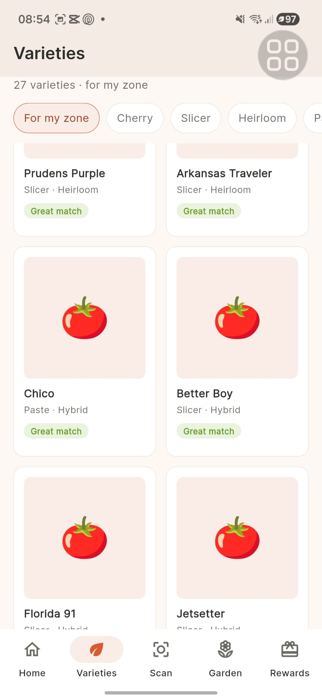
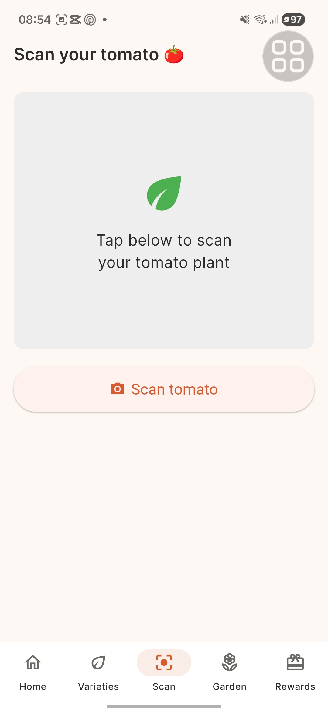
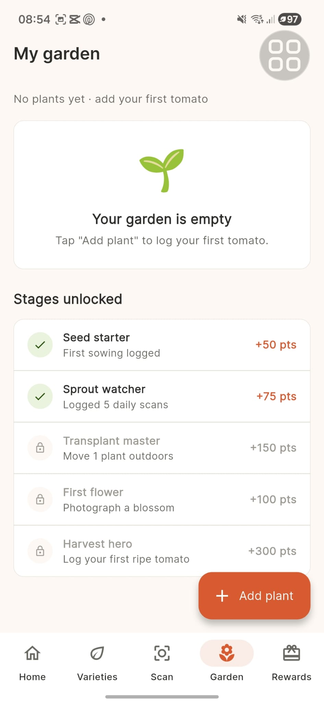
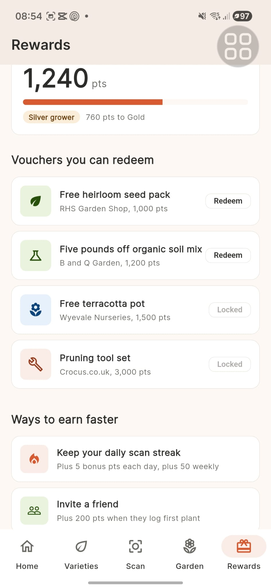

<div align="center">

# 🍅 Tomato Companion

### *A Flutter app that turns growing tomatoes from guesswork into a guided journey.*

[](https://flutter.dev)
[](https://dart.dev)
[](https://firebase.google.com)
[](https://www.anthropic.com)
[](https://flutter.dev)

**CASA0015: Mobile Systems & Interactions**
**UCL · Centre for Advanced Spatial Analysis · 2025/26**

[**🎬 Watch the demo**](https://youtu.be/RDK8aizjWwA) · [**🌐 Microsite**](https://madina1219.github.io/Tomato-Cultivation-Partner/) · [**📐 Design docs**](docs/design.md) · [**🧪 UX testing**](docs/UX_TESTING.md)

</div>

---

## 📑 Contents

1. [About this app](#-about-this-app)
2. [Demo video](#-demo-video)
3. [The user - meet Maya](#-the-user--meet-maya)
4. [Storyboard - Maya's journey](#-storyboard--mayas-journey)
5. [Screenshots -  real Samsung A17 5G](#-screenshots--real-device-samsung-a17-5g)
6. [Features](#-features)
7. [Architecture & technology stack](#%EF%B8%8F-architecture--technology-stack)
8. [Installation](#-installation)
9. [Project structure](#-project-structure)
10. [Testing on real hardware](#-testing-on-real-hardware)
11. [Bibliography & credits](#-bibliography--credits)
12. [Contact](#-contact)
13. [Declaration of authorship](#-declaration-of-authorship)

---

## 🌱 About this app

**Tomato Companion** is a Flutter mobile application built for the CASA0015 *Mobile Systems & Interactions* module at UCL CASA. It helps urban tomato growers, particularly UK balcony, windowsill, and small-garden growers, succeed with their plants from seed to harvest.

The app combines:

- 🌤️ **Live local weather** from Open-Meteo, mapped to *what to do today*
- 📸 **Claude vision diagnosis** -  point your camera at any plant, get conversational AI advice
- 🍅 **27 curated tomato varieties** matched to UK growing windows
- 🌿 **Per-plant garden tracking** from seedling to harvest
- 🎁 **A rewards loop** that redeems for real partners (B&Q, Royal Horticultural Society)

**Why it exists**: First-time tomato growers fail at the same handful of things :  wrong variety for the climate, missed watering, panicking over normal yellow leaves, abandoning by mid-summer. The information *exists*, but it's scattered, generic, and rarely tells you what to do *today, in your weather, with your plant*. Tomato Companion compresses that into a pocket assistant that knows where you are and what you're growing.

---

## 🎬 Demo video

[](https://youtu.be/RDK8aizjWwA)

> 📺 Click the thumbnail above to watch the narrated walkthrough-filmed on a **real Samsung Galaxy A17 5G** running Android 16. Includes the live Claude vision scan moment.

---

## 👤 The user — meet Maya

User-centred design started with a primary persona, derived from informal conversations with first-time growers in London during the design phase (October 2025).



**Maya is the primary persona** the app is designed for: a 24-year-old student living in a small London flat with a balcony, no growing experience, and limited patience for generic advice. She represents a significant segment of new urban growers in the UK - young, time-poor, space-constrained, and intimidated by the gap between Instagram garden-aesthetic content and the practical reality of keeping a single plant alive. Full persona documentation, including the secondary persona (Greg, 67, retired allotment holder), lives in [`docs/design.md`](docs/design.md).

---

## 🎞️ Storyboard - Maya's journey

The storyboard below captures the emotional arc the app was designed around: from the **frustration of not knowing** through to the **competence of a successful harvest**. Every screen in the app maps to a moment in this arc.



| Panel | Moment | App response |
|---|---|---|
| **1** | Maya is stuck. Yellow leaves, conflicting Google answers. | She doesn't have the app yet — this is the pain point that brings her in. |
| **2** | Opens Tomato Companion. The Today screen already knows her location and today's weather. | Geolocator + Open-Meteo → contextual advice card: *"Skip watering, rain at 6pm"*. |
| **3** | Taps Scan. Points camera at her plant. | Anthropic Claude vision identifies nitrogen deficiency in conversational language. |
| **4** | Six weeks of guided daily care → her first homegrown tomatoes. | Points earned along the way redeem for a real B&Q voucher. She'll grow again. |

This four-beat narrative - *frustration → first relief → real diagnosis → competence and reward*, drives every design decision in the app, from the warm "Companion says…" voice in the AI response card to the deliberate restraint of using only one accent colour throughout.

---

## 📱 Screenshots - real device (Samsung A17 5G)

<div align="center">

<table>
<tr>
<td align="center" width="33%">
<br>
<sub><b>Custom launcher icon</b><br>"Tomato Companion" with bespoke 🍅 icon on the Android home screen</sub>
</td>
<td align="center" width="33%">
<br>
<sub><b>Splash screen</b><br>Tomato-red splash plays on every cold launch</sub>
</td>
<td align="center" width="33%">
<br>
<sub><b>Today screen</b><br>Live local weather, today's tasks, contextual advice</sub>
</td>
</tr>
<tr>
<td align="center" width="33%">
<br>
<sub><b>Varieties</b><br>27 UK-friendly varieties in a tappable grid with Hero animations</sub>
</td>
<td align="center" width="33%">
<br>
<sub><b>Scan — Claude vision</b><br>AI diagnosis of any plant in plain English</sub>
</td>
<td align="center" width="33%">
<br>
<sub><b>My Garden</b><br>Per-plant tracking from seedling through to harvest</sub>
</td>
</tr>
<tr>
<td align="center" width="33%">
<br>
<sub><b>Rewards</b><br>Points redeem at B&Q, RHS, and other real partners</sub>
</td>
<td></td>
<td></td>
</tr>
</table>

</div>

---

## ✨ Features

| Feature | What it does | The tech |
|---|---|---|
| 🌤️ **Today screen** | Greets you with your local weather; tells you whether to water, skip, or worry about frost | Open-Meteo API · `geolocator` plugin |
| 📸 **AI plant scan** | Camera viewfinder + Claude vision = conversational plant diagnosis | Anthropic Claude API · `camera` plugin |
| 🍅 **27 tomato varieties** | UK-curated varieties with growing windows, traits, and difficulty levels | Local JSON · `Hero` animations |
| 🌿 **Garden tracker** | Track each plant from seedling to harvest with timestamped growth logs | `shared_preferences` |
| 🎁 **Rewards loop** | Earn points for daily actions; redeem at B&Q, RHS, and partner brands | Local state + partner integrations |
| 🔐 **Firebase Auth** | Sign in to sync your garden across devices | Firebase Authentication |
| 🎨 **Material 3 design** | Custom tomato-red theme, Hero transitions, staggered list animations | Flutter Material 3 |

---

## 🏗️ Architecture & technology stack

```
┌─────────────────────────────────────────────────────────┐
│              Flutter app (Dart, Material 3)             │
│   Hero animations · staggered transitions · custom UI   │
└─────────────────────────────────────────────────────────┘
                          │
       ┌──────────────────┼──────────────────┐
       ▼                  ▼                  ▼
  ┌─────────┐       ┌──────────┐      ┌──────────────┐
  │ Open-   │       │ Anthropic│      │ Firebase     │
  │ Meteo   │       │ Claude   │      │ Auth         │
  │ Weather │       │ Vision   │      │              │
  └─────────┘       └──────────┘      └──────────────┘
       │                  │                  │
       └──────────────────┴──────────────────┘
                          │
                          ▼
              ┌────────────────────┐
              │ Local storage      │
              │ (shared_prefs)     │
              │ + variety JSON     │
              └────────────────────┘
```

**Why these choices**:

- **Open-Meteo** over OpenWeatherMap or AccuWeather: genuinely free with no API key for non-commercial use, and UK forecast accuracy is excellent.
- **Anthropic Claude** for vision: the conversational tone matches the "companion" voice of the app - generic classification APIs return labels, Claude returns *advice*.
- **Firebase Auth**: cross-device sync without standing up a backend.
- **Local-first** for everything else: keeps the app responsive and works on flaky balcony Wi-Fi.

---

## 🚀 Installation

### Prerequisites

- Flutter SDK 3.x ([install instructions](https://docs.flutter.dev/get-started/install))
- Android Studio or VS Code with Flutter extensions
- An Android device or emulator (Android 9+ supported; primarily tested on Android 16)
- An [Anthropic API key](https://console.anthropic.com) for the scan feature
- A [Firebase project](https://console.firebase.google.com) with Authentication enabled (for sync)

### Setup

```bash
# 1. Clone the repository
git clone https://github.com/Madina1219/Tomato-Cultivation-Partner.git
cd Tomato-Cultivation-Partner

# 2. Install dependencies
flutter pub get

# 3. Configure your API keys (see "Secrets" below)

# 4. Generate launcher icon + splash screen
dart run flutter_launcher_icons
dart run flutter_native_splash:create

# 5. Run on a connected device
flutter run
```

### Secrets

The app expects an Anthropic API key in `lib/core/secrets.dart` (gitignored). Create the file with:

```dart
class Secrets {
  static const String anthropicApiKey = 'sk-ant-your-key-here';
}
```

Firebase is configured via `firebase_options.dart` (auto-generated by `flutterfire configure`).

### Plugin versions

The app currently assumes these plugin versions (declared in `pubspec.yaml`):

- `flutter: ^3.x`
- `geolocator: ^11.x`
- `camera: ^0.10.x`
- `firebase_auth: ^4.x`
- `shared_preferences: ^2.x`
- `flutter_launcher_icons: ^0.14.1`
- `flutter_native_splash: ^2.4.1`

---

## 📚 Project structure

```
tomato_companion/
├── lib/
│   ├── core/                # Theme, secrets, shared models
│   ├── features/
│   │   ├── home/            # Today screen + weather widgets
│   │   ├── varieties/       # Varieties grid + detail
│   │   ├── scan/            # Camera + Claude integration
│   │   ├── garden/          # User's planted tomatoes
│   │   └── rewards/         # Points + partner brands
│   └── main.dart
├── assets/
│   ├── branding/            # Launcher icon + splash assets
│   └── varieties.json       # Curated 27-variety database
├── docs/
│   ├── design.md            # Personas, storyboards, journey maps
│   ├── UX_TESTING.md        # Self-conducted usability evaluation
│   ├── screenshots/         # Real-device screenshots
│   └── storyboard/          # Storyboard panels + persona art
└── android/ios/...          # Platform configs
```

---

## 🧪 Testing on real hardware

The app was developed on the Android emulator (Pixel 7, API 36) and **tested extensively on a real Samsung Galaxy A17 5G running Android 16**, connected via wireless ADB debugging over Wi-Fi.

The [demo video](https://youtu.be/RDK8aizjWwA) was filmed on the Samsung A17, demonstrating:

- ✅ Real Geolocator API calls returning real London coordinates
- ✅ Live Open-Meteo weather data for the actual location
- ✅ Real Anthropic Claude vision responses to live camera input
- ✅ Material 3 navigation behaviour on real touch hardware
- ✅ Custom launcher icon and splash screen on a real Android home screen

A self-conducted usability evaluation is documented in [`docs/UX_TESTING.md`](docs/UX_TESTING.md).

---

## 📖 Bibliography & credits

The project draws on the following resources for code, plugins, and design inspiration:

1. **Flutter Team**. (2025). *Flutter documentation*. Google. Available at: <https://docs.flutter.dev>
2. **Anthropic**. (2025). *Claude API documentation — vision capabilities*. Available at: <https://docs.anthropic.com/en/docs/build-with-claude/vision>
3. **Open-Meteo**. (2025). *Free weather forecast API documentation*. Available at: <https://open-meteo.com/en/docs>
4. **Material Design Team**. (2025). *Material Design 3 specification*. Google. Available at: <https://m3.material.io>
5. **Royal Horticultural Society**. (2024). *Tomatoes - growing guide*. London: RHS. Available at: <https://www.rhs.org.uk/vegetables/tomatoes/grow-your-own>
6. **flutter_launcher_icons** (Mark O'Sullivan). Version 0.14.1. Available at: <https://pub.dev/packages/flutter_launcher_icons>
7. **flutter_native_splash** (Henry Tabima). Version 2.4.1. Available at: <https://pub.dev/packages/flutter_native_splash>

Plugins used (pub.dev): `geolocator`, `camera`, `firebase_core`, `firebase_auth`, `shared_preferences`, `http`, `intl`, `flutter_launcher_icons`, `flutter_native_splash`.

---

## ✉️ Contact

**Madina Diallo**
MSc Connected Environments candidate · UCL CASA · 2025/26
GitHub: [@Madina1219](https://github.com/Madina1219)

For questions about the code or design choices, please open an issue on the repository.

---

## 📝 Declaration of authorship

I, Madina Diallo, confirm that the work presented in this assessment is my own. Where information has been derived from other sources, I confirm that this has been indicated in the work above (see the Bibliography & Credits section).

Use of AI assistance. In line with UCL's policy on the use of generative AI in assessments, I disclose that Anthropic's Claude (Opus 4.7) was used as an AI coding assistant throughout the development of this application.

All design decisions, the choice of features, the user persona and storyboard, the visual identity, the variety database curation, and the integration of all components into a working application are my own work. Every AI-suggested code change was reviewed, understood, modified where needed, and committed by me. The same applies to the AI API key configuration - the Anthropic API key used for the scan feature is my own, obtained through an Anthropic developer account.

The mobile application source code, design documents, screenshots, demo video, and microsite are all produced by me for CASA0015: Mobile Systems & Interactions, 2025/26.

Digitally signed: Madina Diallo

---

<div align="center">

*Built with Flutter, Firebase, Claude, and a lot of care.* 🍅

</div>
